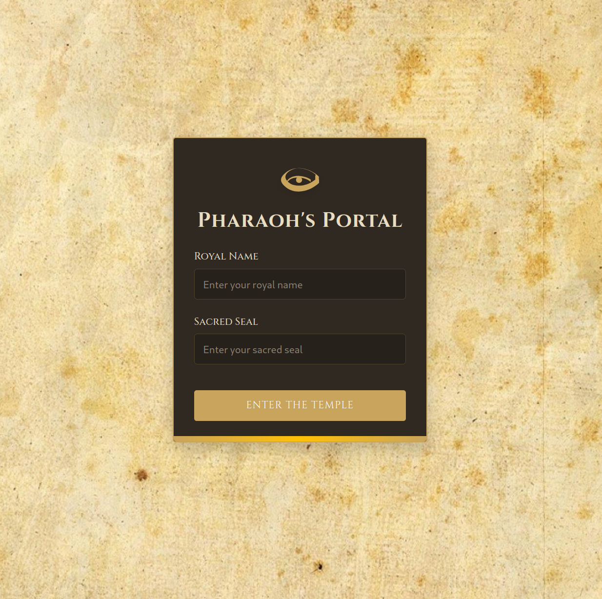
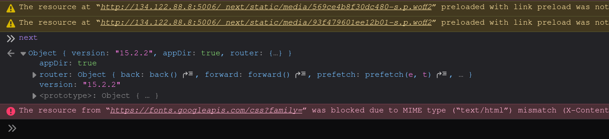
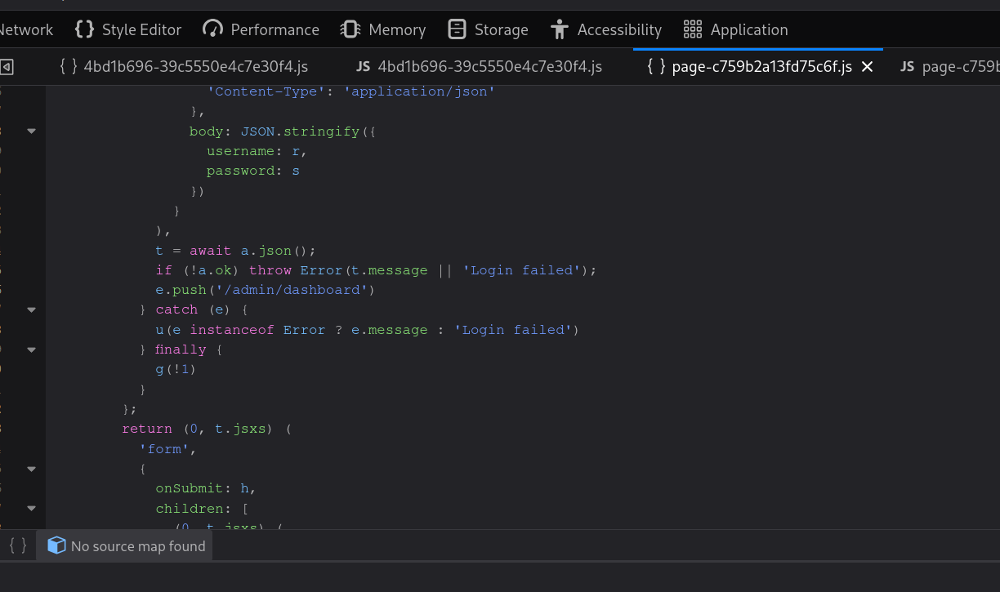
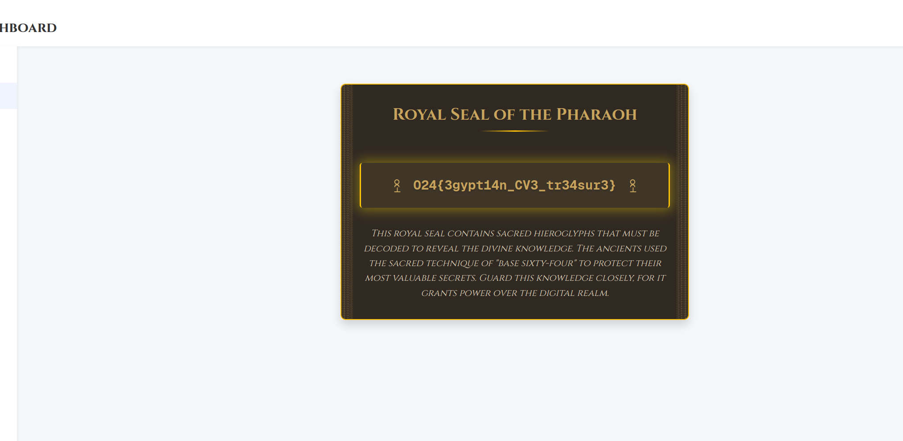

# Pharaoh's Dashboard
Bruteforcing is not an option, the Pharaoh was known for his lengthy passwords, but maybe there is another way to bypass middleware authorization and gain access to the admin panel. Can you uncover the flaw and seize control of the Pharaoh’s secrets?

Challenge type: Authentication

## Solution
The web page prompts the user to login with a username and password

Based on the description of the challenge, we probably need to bypass some middleware. Looking in the debugger and typing `next` into the console, we see that the application is running **Next.js 15.2.2**.

Further checking the source code, we also found the path `admin/dashboard`:

Searching the web with using the following keywords: **Next.js 15.2.2, Vulnerability and Middleware bypass** I found the article: https://www.neoxs.me/blog/critical-nextjs-middleware-vulnerability-cve-2025-29927-authentication-bypass.
The article writes that adding the header `x-middleware-subrequest: src/middleware:src/middleware:src/middleware:src/middleware:src/middleware` to a request stop the middleware from running. Adding this header when requesting the `admin/dashboard` page gives access to the dashboard, where the flag is revealed: **O24{3gypt14n_CV3_tr34sur3}**

