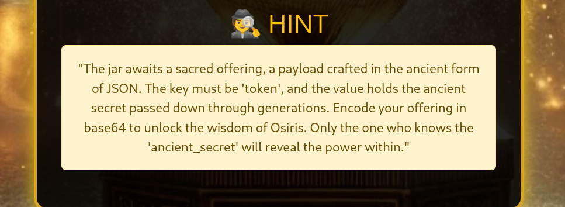

# The Canopic Jars of Osiris
An ancient map led you deep into the Egyptian desert, where the Canopic Jars of Osiris held secrets of unimaginable power. To unlock them, you had to decipher cryptic clues left by the gods themselves.

Your first challenge: "Only those who understand the whispers of the past may claim the treasures of the gods..." With every riddle solved and trap avoided, you drew closer to the jar. But to unlock it, you needed the right token.

After a thrilling journey, you finally found it, unlocking the jar and revealing the long-lost knowledge of Osiris.

Challenge author: Magnus Eriksson - Magnus.Eriksson@outpost24.com  
Challenge type: Extra

## Solution
The web page prompts for an offering to pe provided.

Submitting some text, gives the error: `Error processing the offering: Expecting value: line 1 column 1 (char 0)`. Searching the interwebs for this error, shows that is likely comes from the json python library. 

Entering some json data, gives a new error `Error processing the offering: Invalid base64-encoded string: number of data characters (9) cannot be 1 more than a multiple of 4`. This likely means that the json need be base64 encoded.

Submitting the json as a base64 string, gives the response: `Incorrect token. Keep trying!`.

At this point, I was left pretty stumped. I knew how the string should be submitted, but not which key or value should be in the json. After testing many key and value combinations, I gave in and looked at the hint. 

From the hint, we get that the key of the json should be 'token' and that the value should be some ancient secret. After some searching and testing different values, we tested the json: `{"token": "ancient_secret"}` which gave us the flag: **O24{soul_of_osiris_bound_within_the_cursed_vessel}**

