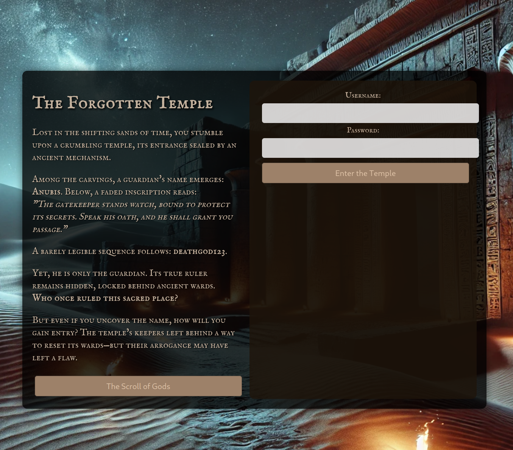
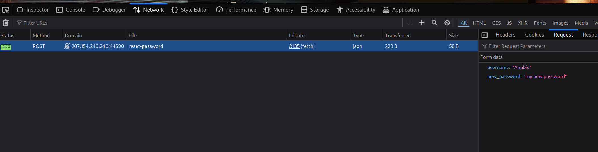
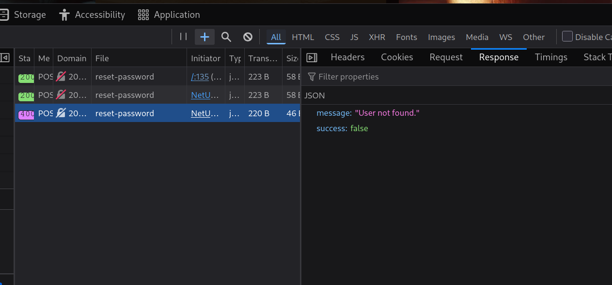
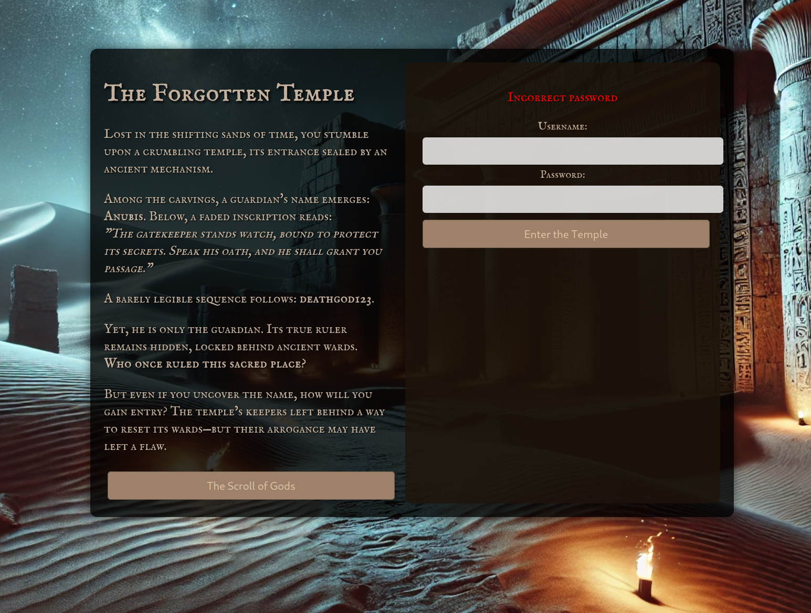
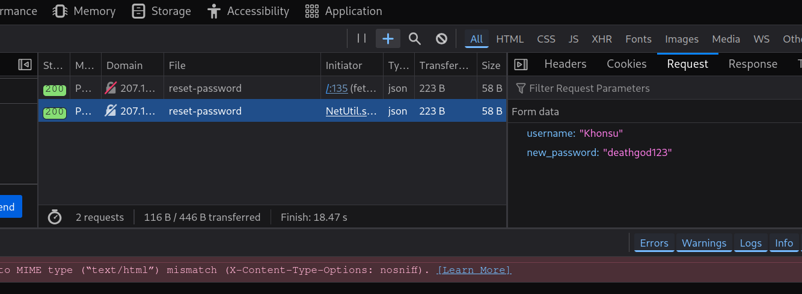
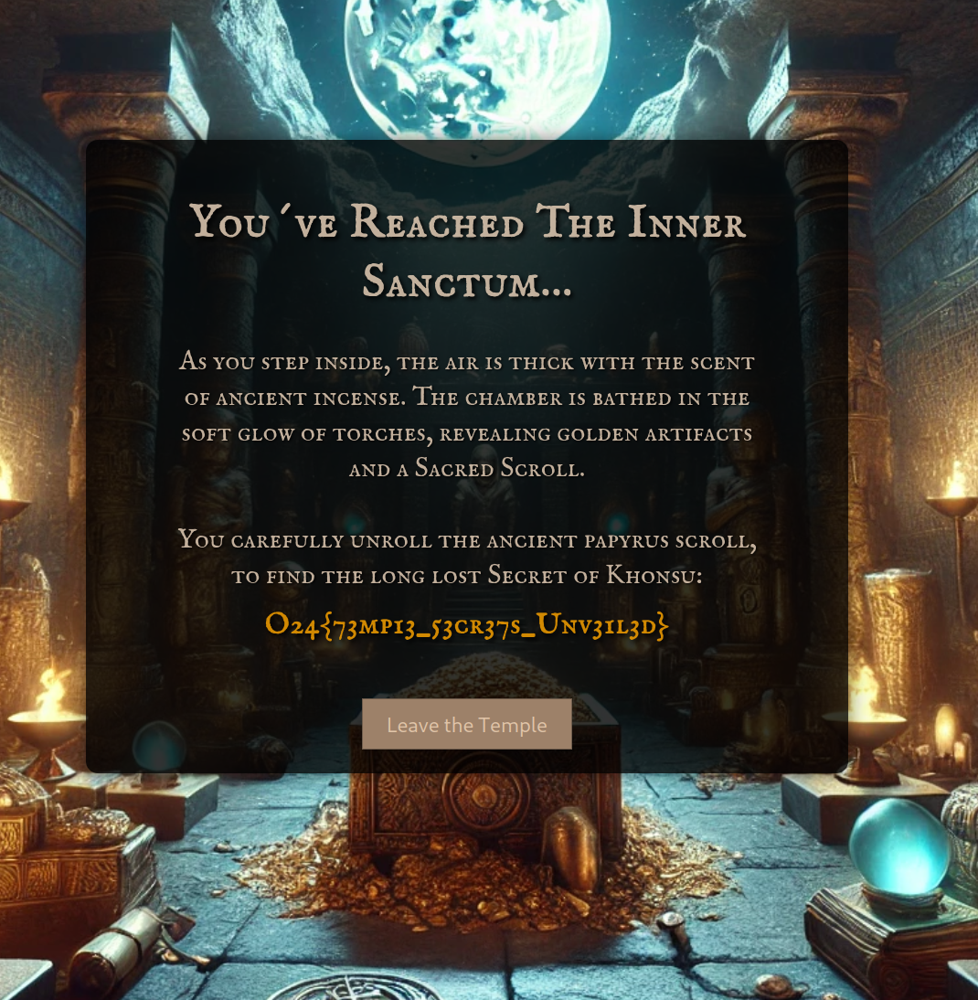

# The Forgotten Temple 
The temple stands locked behind divine wards, its secrets protected by ancient code and loyal guardians. Anubis watches the gate, his oath etched in time.

But whispers speak of another—one who walks in moonlight, whose presence is hidden behind layers of deception. Perhaps the ancients left behind more than just defenses... a remnant of their pride, a flaw waiting to be uncovered.

Challenge made by: Cathleene Sandgren  
Challenge type: Authentication

## Solution

The web page prompts the user to login with a username and password. Reading the text, we see a possible username and password of `Anubis` and `deathgod123`. 

Entering the credentials gives a new page where the user can reset the password of the current user. When sending the password reset request to the server, the application also add the username in the request body:

Sending a request with a random username, we get a "User not found." response:

This probably means the password of any known username can be changed using this endpoint. The problem is that we do not know any username.

From the login page, we have "The Scroll of Gods" which contains a list of usernames. Testing all the passwords from the list, shows that the username **Khonsu** gives the response `Incorrect password`.

Using the endpoint from before, we can reset the password for the user **Khonsu**:

Logging in to the user **Khonsu** gives the flag: **O24{73mp13_53cr37s_Unv31l3d}**
