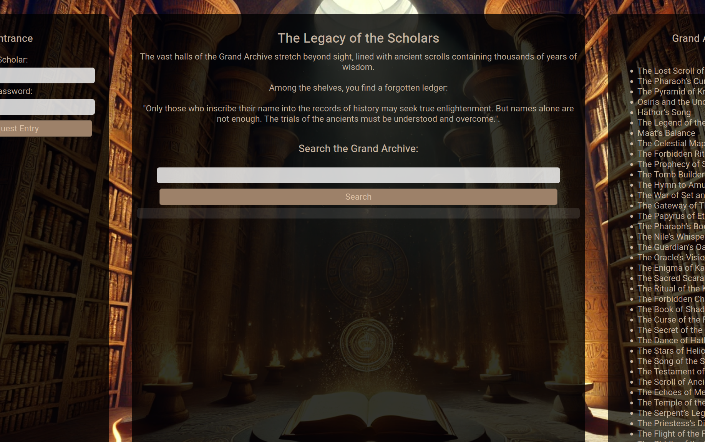
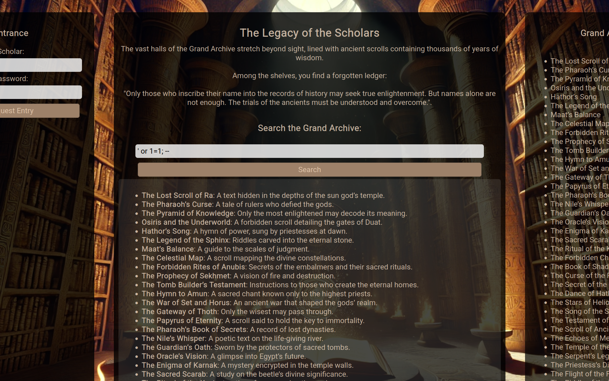
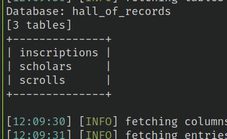
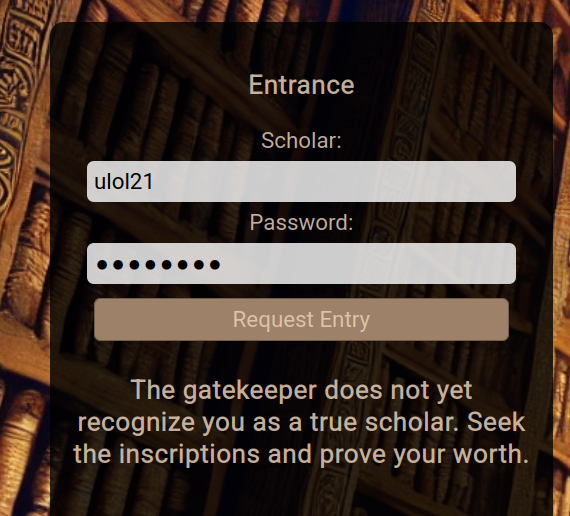
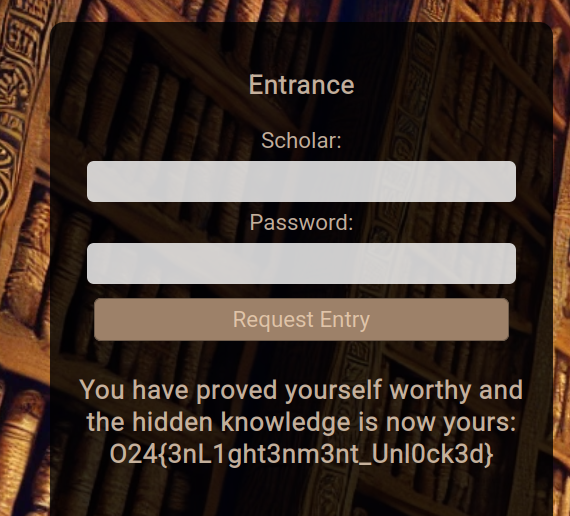

# The Legacy of the Scholars
Within the Grand Archive, thousands of scrolls whisper secrets of a forgotten age. Only those who inscribe their names into the sacred records may request access to the hidden knowledge.

Yet the ancients, for all their wisdom, left behind subtle cracks in their defenses. Can you uncover the path to enlightenment... or will your name fade among the unworthy?

Challenge made by: Cathleene Sandgren  
Challenge type: SQLI

## Solution
Entering the web page, there is a login section and a search section:

Trying some basic SQLi statements at the login section, gives no unexpected results. Moving over to the search feature and trying some SQLi statments shows that the input is susceptible to injections using the command: `' or 1=1; --`

Now that we know that the search feature is vulnerable to SQL injections, we can use SQLMAP to quickly dump the tables:

The database contains three tables:
* `scrolls` containing a **title** and **content**.
* `scholars` containing **usernames** and unhashed **passowrds**
* `inscriptions` containing **scholar_id** and **access granted**.

Based on the text on the web page: "Only those who inscribe their name into the records of history may seek true enlightenment.". My guess is that I need to create a new user in the scholars table. This can be done by stacking/piggybacking on the previous statment: `' or 1=1; INSERT INTO scholars(username, password) VALUES ('ulol21', 'p4ssword'); -- `. Trying to login with the new account, I got the following response:

Redumping the database using sqlmap, we see that the user has been added, however no entry has been created in the `inscriptions` table. Inserting a new entry in `inscriptions`, setting **access_granted** to 1 for the new user and logging in, we get the flag: **O24{3nL1ght3nm3nt_Unl0ck3d}**

