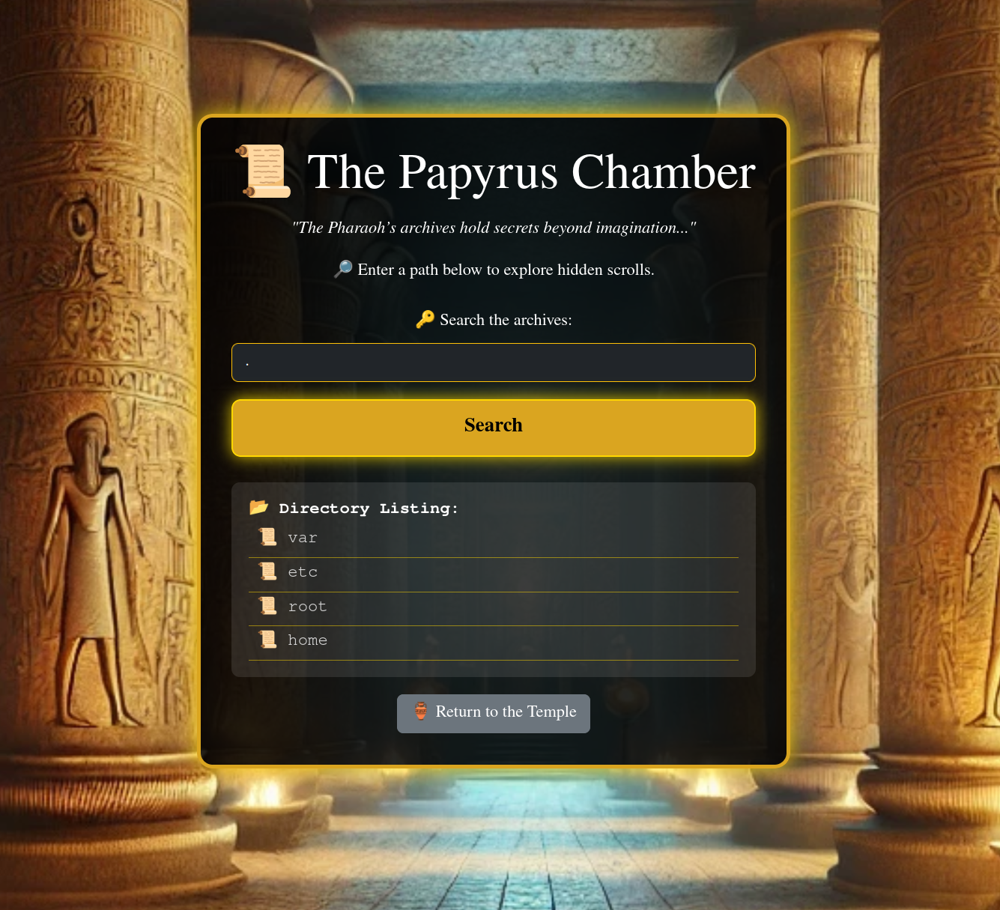
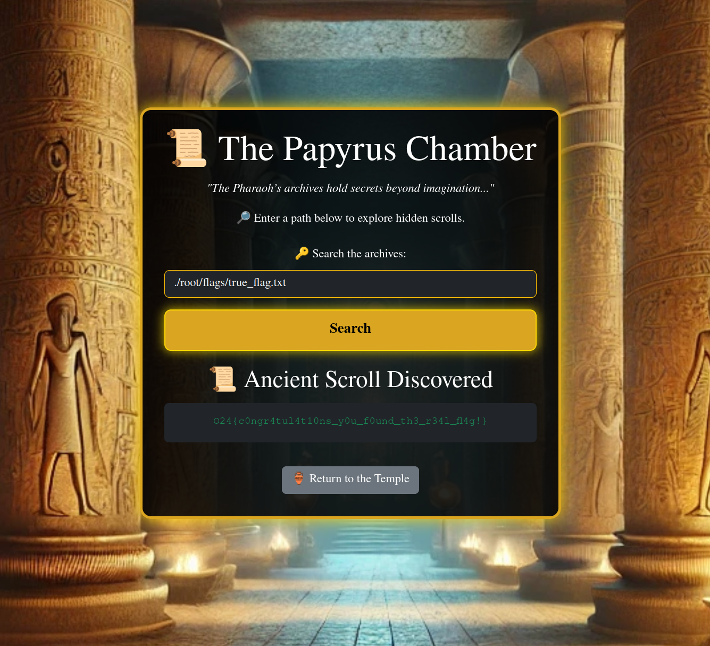

# The Lost Scrolls of the Pharaoh 
Deep within the pharaoh's library, ancient scrolls hold the key to unlocking powerful secrets. Unfortunately, the digital archive system has a path traversal vulnerability. Your task is to exploit this flaw to access restricted scrolls and reveal the pharaoh's hidden knowledge. Will you be able to traverse the directories and find the forbidden scrolls?

Challenge author: Magnus Eriksson - Magnus.Eriksson@outpost24.com  
Challenge type: Path Traversal

## Solution
When visiting the web page, you are prompted to "Search the archives". Since this is a path traversal challange, I started subitting common files in the Linux file system. Entering `.` as input, gave a directory structure.  

Trying to enter root directory with `./root` we see a directory named `flags`. Entering this directory we find the file `true_flag.txt` containing the flag: **O24{c0ngr4tul4t10ns_y0u_f0und_th3_r34l_fl4g!}**

