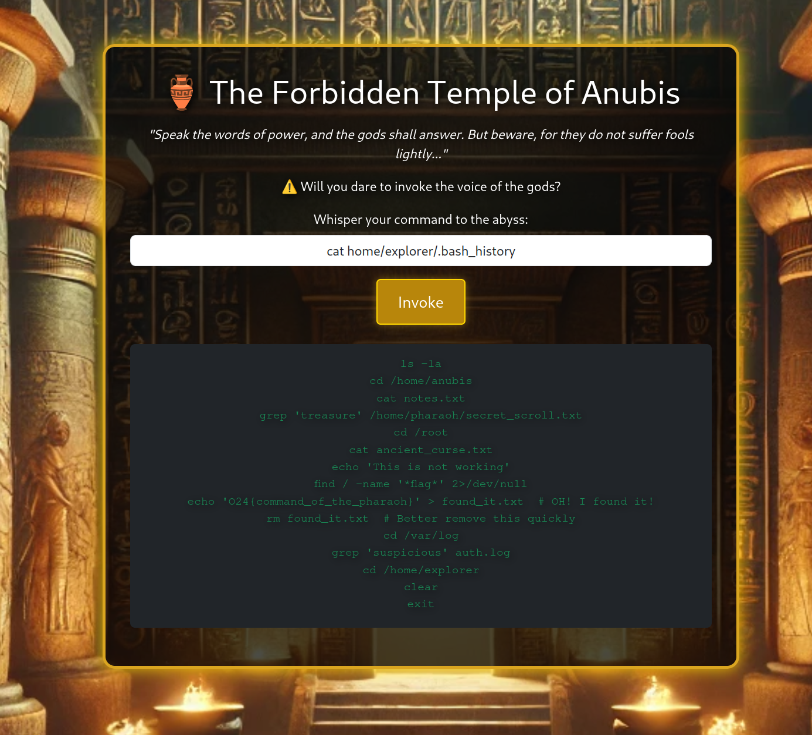

# The Pharaoh’s Command Center
In the heart of ancient Egypt, a mysterious tomb has been discovered, believed to belong to a long-forgotten pharaoh. However, the tomb is protected by a modern security system that can be manipulated through OS command injection. Your mission is to exploit this vulnerability to gain access to the tomb's secrets. Can you navigate the treacherous commands and uncover the hidden treasures within?

Challenge author: Magnus Eriksson - Magnus.Eriksson@outpost24.com  
Challenge type: Os Command Injection

## Solution
The page prompts the user to enter a command:

Entering `ls` gives us the familiar Linux file structure:

Checking the `home` dir, we see three users:

Checking out the **explorer** user, we see the file `.bash_history`:

Checking the `.bash_history` we see the flag: **O24{command_of_the_pharaoh}**
