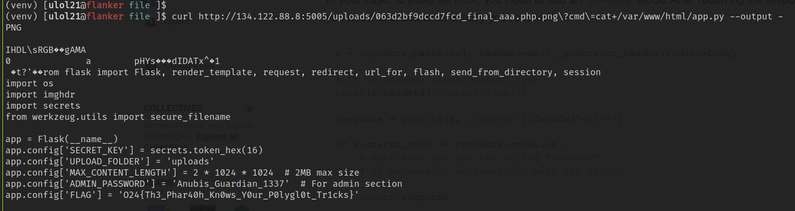

# The Pharaoh's Gallery
Look at this magnificent scroll. It must be preserved at all cost.
Let's bring it back to our exhibit.

Challenge type: File Upload

## Solution
The web page prompts you to either upload an image or to view the gallery:

Going to the upload page, you are prompted to upload an image in the following formats: .jpg, .jpeg, .png, .gif.

After uploading an image, it can be seen in the gallery:

After testing different techniques, and uploading different files, the application makes sure that uploaded files has one of the allowed extensions and that the it has the correct "magic bytes".

To get command execution on the system, the "magic bytes" and the IHDR section from a .png file was extracted using the `dd` command. 

The end of the same .png was also extracted using `dd`:

The middle of the file is going to contain the PHP code we want to execute. For this challenge, PHP code was that executes strings passed in the **cmd** paramter:

A single "image" file was created using the cat command:

Uploading the file to the server and accessing it, shows that it want us to supply a command via the **cmd** paramter. Supplying a command results in successfull execution of the command:

After spending some time looking though different files and directories, the flag was located in `/var/www/html/app.py`. Flag: **O24{Th3_Phar40h_Kn0ws_Y0ur_P0lygl0t_Tr1cks}**

