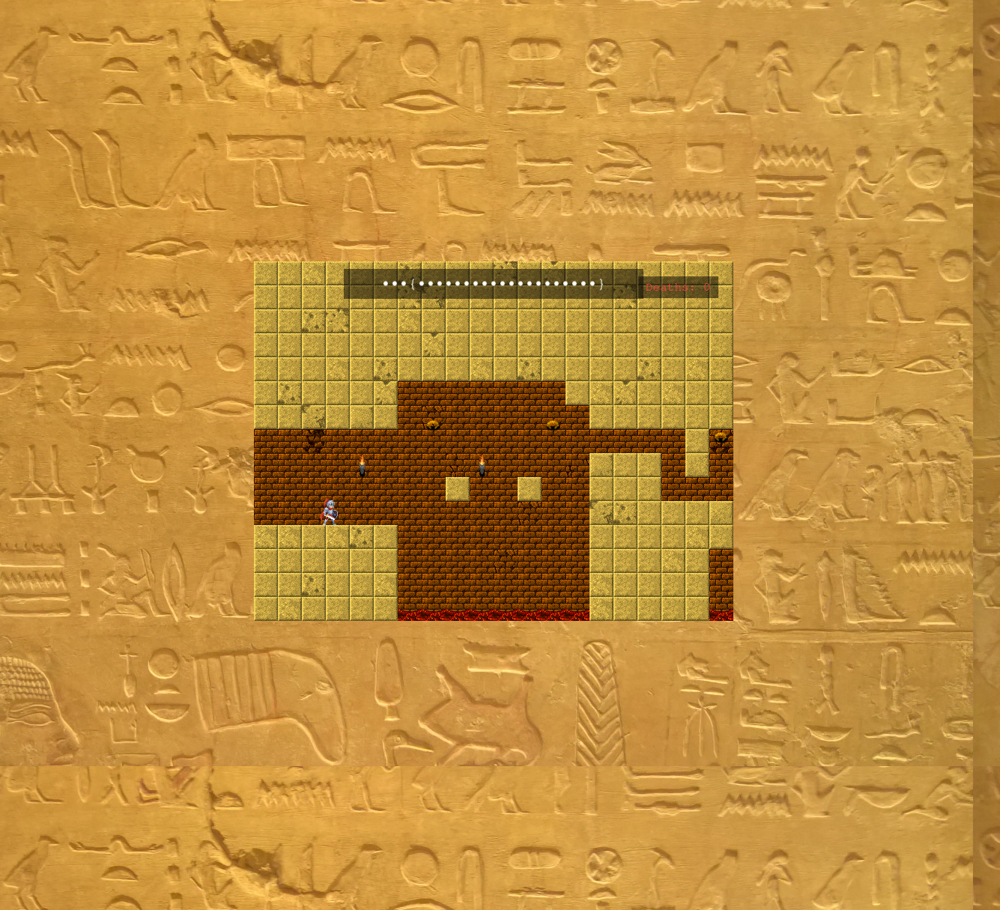
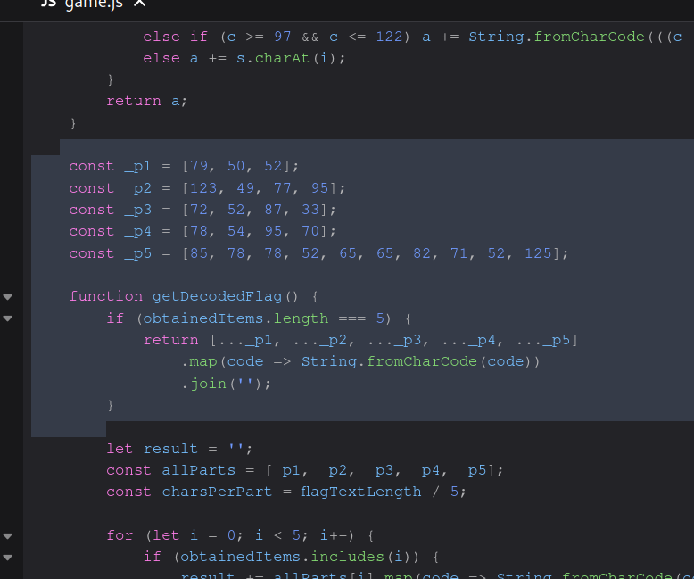
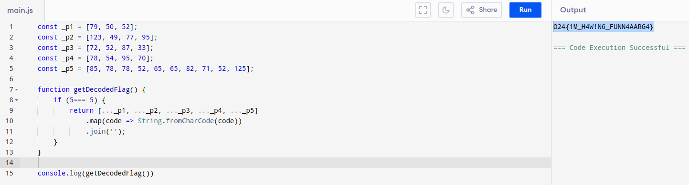

# Tomb Raider
Our hero is in trouble and he needs your help!
Help him collect all the rare artifacts and unlock the secret.
But beware, danger lurks around every corner...

Challenge type: Extra

## Solution
Visiting the website, you are prompted with a game:

Playing the game for some time, we realise that is pretty difficult and unfair. Checking the source code we find the file `game.js` containisng a function named `getDecodedFlag()`
 

Copying the code to an online compiler and executing the funtion, we get the flag: **O24{1M_H4W!N6_FUNN4AARG4}**
